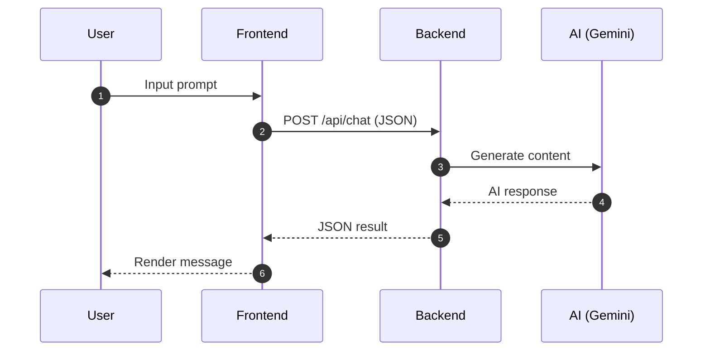
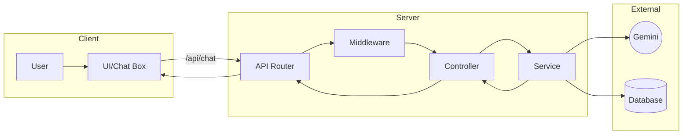

<div align="center">

  # 🌍 **Travel Chatbot AI Assistant** 🤖

  **Your intelligent travel companion, powered by Google Gemini.** ✈️

  <p>
    <a href="https://nodejs.org/en/about/releases/"></a>
    <a href="https://opensource.org/licenses/MIT"></a>
    <a href="#"></a>
    <a href="#"></a>
  </p>

  > An AI-powered travel assistant that provides personalized recommendations, itinerary planning, and local insights for your next adventure!
</div>

---

## ✨ **Meet Your AI Travel Agent!**

Bayangkan memiliki asisten perjalanan pribadi yang siap 24/7. Itulah **Travel Chatbot**! Ajukan pertanyaan apa pun tentang rencana perjalanan Anda, dan dapatkan jawaban instan yang cerdas dan terstruktur.

<details>
  <summary><strong>👀 Lihat Contoh Aksi</strong></summary>
  <br>
  
  <br>
  <p align="center"><em>Dapatkan rekomendasi, itinerary, dan estimasi budget dalam hitungan detik!</em></p>
</details>

---

## 🚀 **Core Features**

| Feature | Description | Icon |
|---|---|:---:|
| **Smart Recommendations** | Get personalized suggestions for destinations, hotels, and culinary spots. | 💡 |
| **Itinerary Planning** | Create detailed daily travel plans automatically. | 🗺️ |
| **Budgeting** | Receive instant cost estimates for your trip. | 💰 |
| **Local Insights** | Discover hidden gems and authentic local tips. | 💎 |
| **Secure & Fast** | Built with modern security practices and optimized for speed. | 🛡️ |
| **24/7 Availability** | Your travel assistant is always ready to help. | 🕒 |

---

## 🛠️ **Tech Stack**

<div align="center">
  <a href="https://nodejs.org/"></a>
  <a href="https://expressjs.com/"></a>
  <a href="https://ai.google.dev/"></a>
  <a href="https://jestjs.io/"></a>
</div>

---

## 🏗️ **Application Architecture**

Arsitektur aplikasi ini dirancang mengikuti prinsip **Clean Architecture** untuk memastikan kode yang terorganisir, mudah dikelola, dan skalabel.

## **Project Structure**
```
/
├── public/             # Frontend static files (HTML, CSS, JS)
├── src/                # Backend source code
│   ├── config/         # Environment configuration
│   ├── controllers/    # Request handlers
│   ├── middleware/     # Express middleware
│   ├── routes/         # API routes
│   ├── services/       # Business logic
│   └── utils/          # Utility functions
├── tests/              # Test files
├── .env.example        # Environment variable example
├── server.js           # Main server entry point
└── package.json
```

## **Workflow Diagram**
Berikut adalah visualisasi alur kerja dari frontend ke backend, menunjukkan bagaimana setiap permintaan diproses.

```markdown
## 🔁 Request–Response (Sequence)
```



```markdown
## 🧭 Lanes per Komponen
```



<details>
  <summary><strong>🔍 Klik untuk melihat detail setiap komponen</strong></summary>
  
  - **Frontend**: Antarmuka pengguna yang bersih dan responsif (HTML, CSS, JS).
  - **Backend (Node.js & Express)**:
    - **API Routes**: Mendefinisikan endpoint (`/api/chat`).
    - **Middleware**: Melindungi dari serangan (Helmet, CORS), validasi input, dan rate limiting.
    - **Controller**: Mengelola alur permintaan dan respons.
    - **Service Layer**: Memproses logika bisnis dan berkomunikasi dengan Google Gemini.
  - **External Service**:
    - **Google Gemini AI**: Model AI yang menghasilkan respons cerdas.

</details>

---

## ⚙️ **Getting Started**

<details>
<summary><strong>Click here for Installation Guide</strong></summary>

### **1. Clone Repository**
```bash
git clone https://github.com/your-username/travel-chatbot.git
cd travel-chatbot
```

### **2. Install Dependencies**
```bash
npm install
```

### **3. Setup Environment**
Buat file `.env` dari contoh dan tambahkan kunci API Google Gemini Anda.
```bash
cp .env.example .env
```
Lalu, edit file `.env`:
```env
# .env
API_KEY="YOUR_GOOGLE_GEMINI_API_KEY"
PORT=3000
```

### **4. Run the Server**
Mode pengembangan dengan auto-reload:
```bash
npm run dev
```
Server akan aktif di `http://localhost:3000`.

### **5. Health Check**
Verifikasi koneksi server dan AI:
```bash
npm run health
```
</details>

---

## 🎮 **API Usage**

Kirim permintaan `POST` ke `/api/chat` untuk memulai percakapan.

**Contoh Request:**
```bash
curl -X POST http://localhost:3000/api/chat \
     -H "Content-Type: application/json" \
     -d '{
           "message": "Rekomendasi liburan 3 hari di Bandung untuk anak muda"
         }'
```

<details>
  <summary><strong>Klik untuk melihat contoh respons JSON</strong></summary>

```json
{
  "success": true,
  "data": {
    "response": "Tentu! Ini dia rekomendasi liburan seru 3 hari di Bandung untuk anak muda:\n\n**Day 1: City Vibes & Culinary**\n- 🍜 Sarapan di Warung Kopi Purnama\n- 🛍️ Jalan-jalan di Jalan Braga\n- 📸 Foto-foto di Kopi Anjis\n\n...",
    "metadata": {
      "duration": 980,
      "tokensUsed": 410,
      "model": "gemini-1.5-pro"
    }
  }
}
```
</details>


---

## 🤝 **Contributing**

Kontribusi membuat komunitas open-source menjadi tempat yang luar biasa untuk belajar, menginspirasi, dan berkreasi. Setiap kontribusi yang Anda buat **sangat kami hargai**.

1.  Fork the Project
2.  Create your Feature Branch (`git checkout -b feature/AmazingFeature`)
3.  Commit your Changes (`git commit -m 'Add some AmazingFeature'`)
4.  Push to the Branch (`git push origin feature/AmazingFeature`)
5.  Open a Pull Request

---
<div align="center">
  Made with ❤️ for Travelers Worldwide by PRAM
</div>
